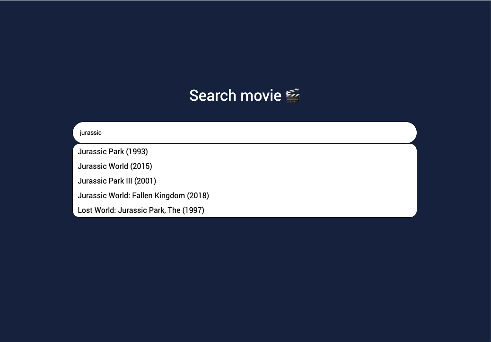

App to autocomplete movies built with Elasticsearch

### Prerequisites
* Docker

### Running the project
1. Index movies
```shell
docker-compose run --rm app python elasticsearch/index_movies.py
```
2. Run the project
```shell
docker-compose up
```
3. Open `http://localhost:8000/` in the browser
4. Search movies 👌
